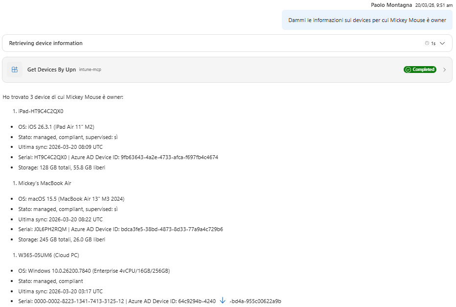

# Use Case 1 - Get Policies by Device

## Description

This use case describes the process of retrieving policies associated with specific devices. It outlines the steps involved in querying the system for policies based on device identifiers and the expected outcomes.

## Question to answer

Which policies are assigned to a device? What is the status of these policies?

## APIs Endpoints

Get Devices by User Principal Name (UPN):

GET https://graph.microsoft.com/beta/deviceManagement/managedDevices?$filter=(userPrincipalName eq 'upn')
 
Get Policies by Device ID:

POST https://graph.microsoft.com/beta/deviceManagement/reports/microsoft.graph.getConfigurationPoliciesReportForDevice

{
  "select": [
    "IntuneDeviceId",
    "PolicyBaseTypeName",
    "UnifiedPolicyType",
    "PolicyId",
    "PolicyName",
    "PolicyStatus",
    "UPN",
    "UserId",
    "PspdpuLastModifiedTimeUtc"
  ],
  "filter": "((PolicyBaseTypeName eq 'Microsoft.Management.Services.Api.DeviceConfiguration') or (PolicyBaseTypeName eq 'DeviceManagementConfigurationPolicy') or (PolicyBaseTypeName eq 'DeviceConfigurationAdmxPolicy') or (PolicyBaseTypeName eq 'Microsoft.Management.Services.Api.DeviceManagementIntent')) and (IntuneDeviceId eq '@{items('For_each')?['id']}')",
  "top": 200,
  "skip": 0,
  "orderBy": [
    "PolicyName"
  ]
}

## Test output

