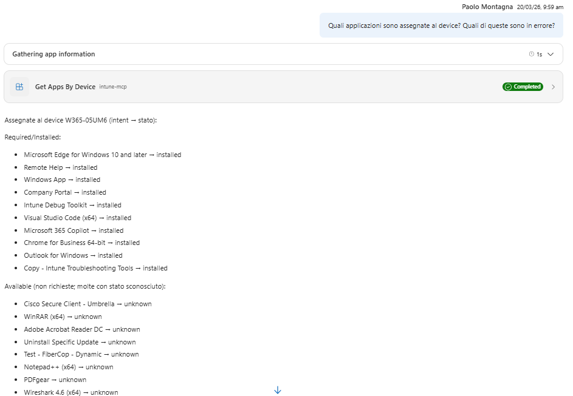

# Use Case 3 - Get Applications by Device

## Description

This use case describes the process of retrieving applications associated with specific devices. It outlines the steps involved in querying the system for applications based on device identifiers and the expected outcomes.

## Question to answer

Which applications are assigned to a device? Which of them are in error?

## APIs Endpoints

Get Applications by User and DeviceId:

GET https://graph.microsoft.com/beta/users(UserID')/mobileAppIntentAndStates('deviceId')

## Test output

 