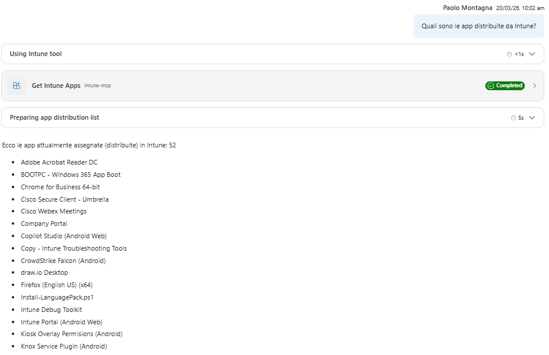

# Use Case 4 - List of Applications Distributed by Intune

## Description

This use case describes the process of retrieving a list of applications distributed by Intune. It outlines the steps involved in querying the system for applications based on device identifiers and the expected outcomes.

## Question to answer

Which app are distributed by Intune?

## APIs Endpoints

Get Applications distributed by Intune:

GET https://graph.microsoft.com/beta/deviceAppManagement/mobileApps

## Test output

 