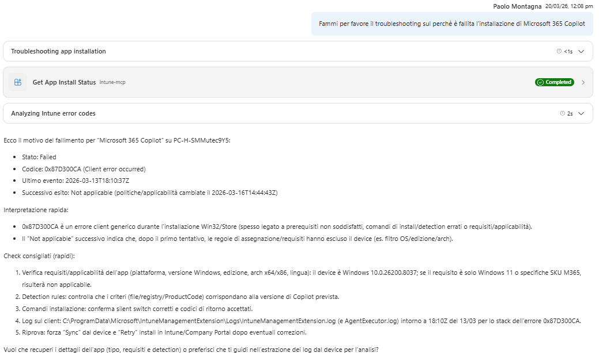

# Use Case 5 - Troubleshoot Application Error

## Description

This use case describes the process of troubleshooting application errors in Intune. It outlines the steps involved in identifying and resolving issues with applications distributed by Intune.
The api can take device name or device id for filtering the results. If the user doesn't remember the application id or you don't have it available, you need a method for obatining the application id from the application name, also if this not exact match; you have to search it.

## Question to answer

An app 'Application Name' is in error on the device 'Device Name', what is the problem reported by the error code if available?  

## APIs Endpoints

Get Applications distributed by Intune:

POST https://graph.microsoft.com/beta/deviceManagement/reports/microsoft.graph.retrieveDeviceAppInstallationStatusReport

{
  "select": [
    "DeviceName",
    "DeviceId",
    "UserPrincipalName",
    "Platform",
    "AppVersion",
    "InstallState",
    "InstallStateDetail",
    "ErrorCode",
    "HexErrorCode",
    "LastModifiedDateTime",
    "UserName",
    "UserId",
    "ApplicationId",
    "AppInstallState",
    "AppInstallStateDetails"
  ],
  "skip": 0,
  "top": 50,
  "filter": "(ApplicationId eq 'fd51e121-39a8-4bcc-982b-c261fb0eb1c0' and DeviceName eq 'DESKTOP-12345')",
  "orderBy": []
}

## Test output

 